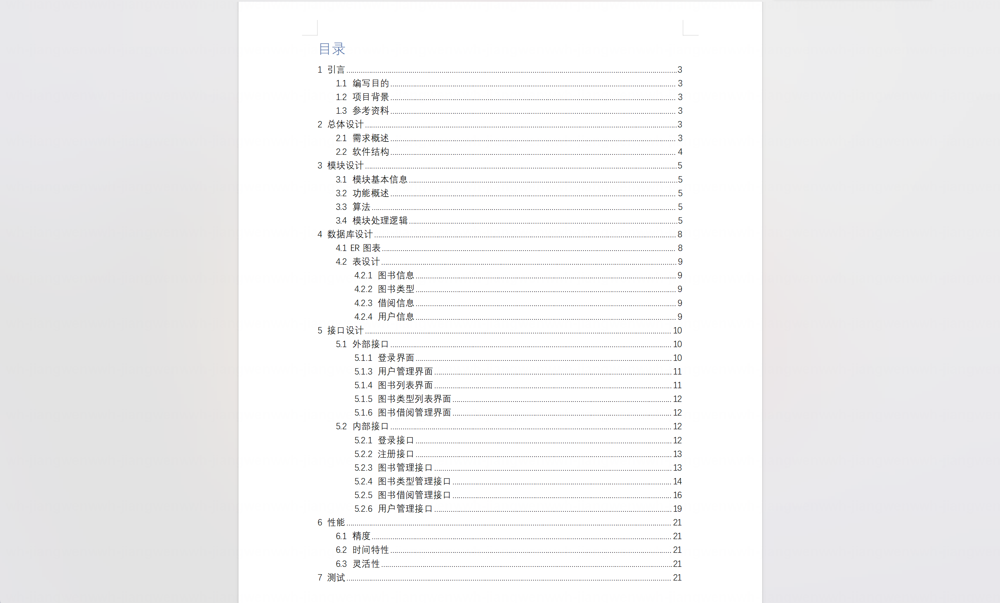
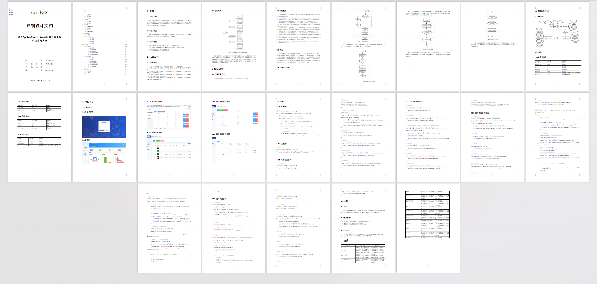
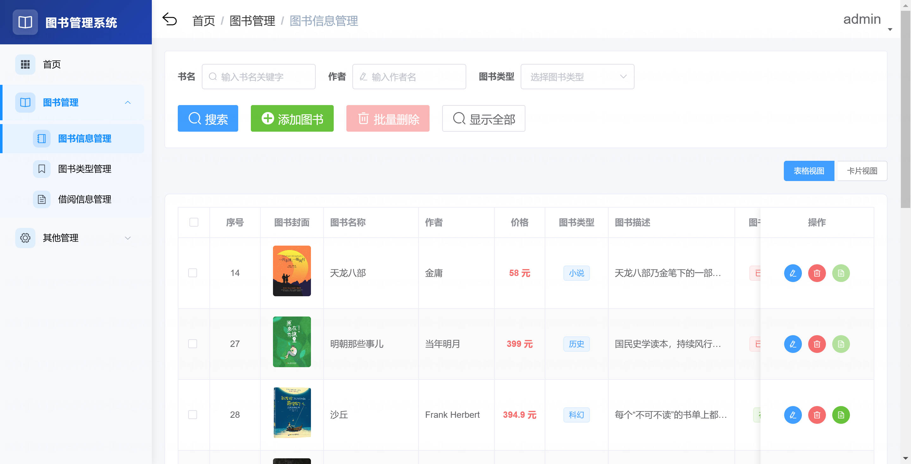
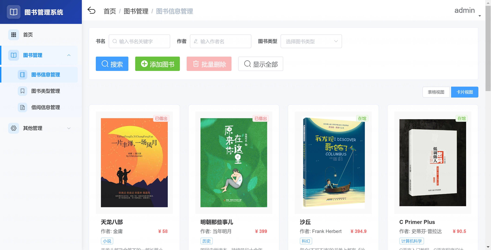
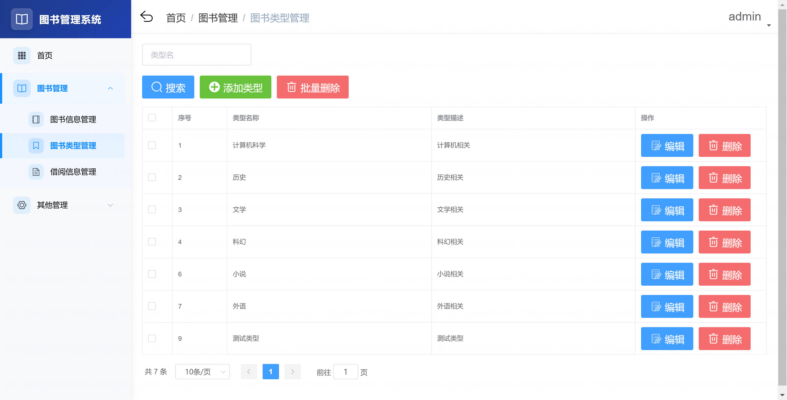
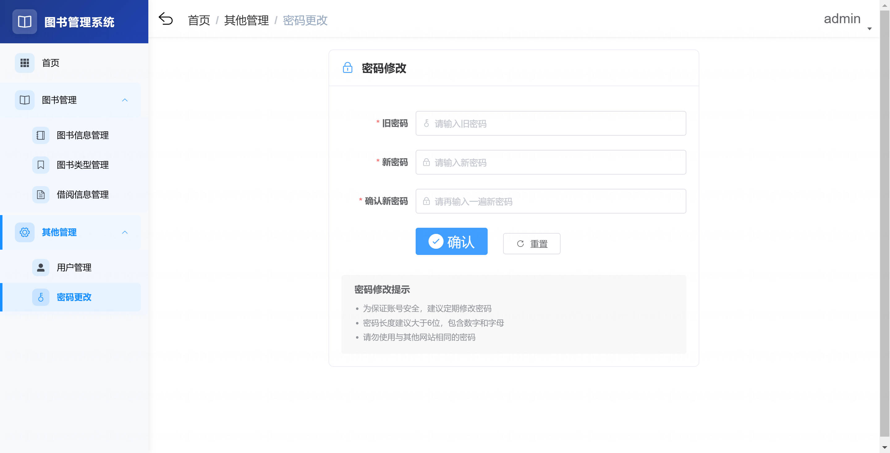
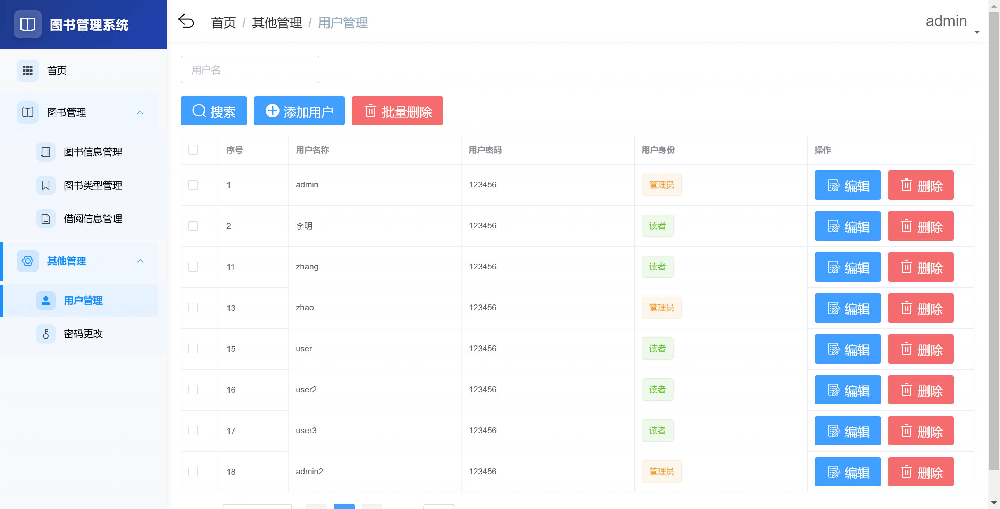
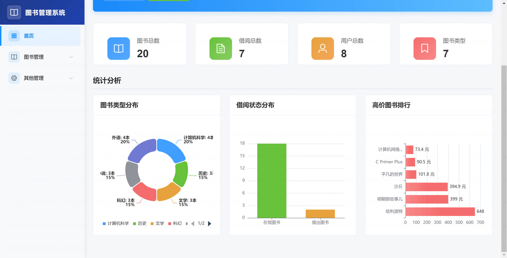
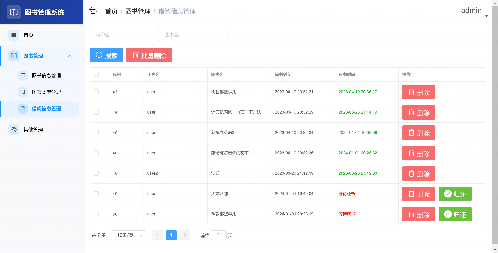

<h1 align="center">基于Spring Boot + Vue 的图书管理系统【带论文】</h1>

- <b>完整代码获取地址：从戎源码网 ([https://armycodes.com/](https://armycodes.com/))</b>
- <b>技术探讨、资料分享，请加QQ群：692619798</b>
- <b>作者微信：19941326836  QQ：952045282</b>
- <b>承接计算机毕业设计、Java毕业设计、Python毕业设计、深度学习、机器学习</b>
- <b>选题+开题报告+任务书+程序定制+安装调试+论文+答辩ppt 一条龙服务</b>
- <b>所有选题地址 ([https://github.com/Descartes007/allProject](https://github.com/Descartes007/allProject)) </b>

## 一、项目介绍

基于 Spring Boot + Vue 的图书管理系统，系统角色为管理员（admin）和读者（reader），主要功能如下
### 管理员（admin）：
- 基本操作：登录、登出、获取个人信息、修改个人信息、修改密码
- 用户管理：查询/分页用户、查看用户详情、新增用户、更新用户、删除单个/批量用户
- 图书管理：查询图书列表、条件分页搜索、查看图书详情、新增图书、编辑图书、删除单个/批量图书、上传图书封面
- 图书类型管理：查询类型列表、条件分页、查看、新增、编辑、删除单个/批量类型
- 借阅管理：查询/分页借阅记录、添加/更新/删除借阅记录、为任意用户借书/还书
- 仪表盘/统计：图书类型分布、借阅状态等统计展示
### 读者（reader）：
- 基本操作：登录、登出、获取个人信息、修改个人信息、修改密码
- 浏览图书：查看图书列表、按条件搜索、查看图书类型列表
- 借阅操作：查询个人借阅记录、借书、还书（使用 reader 对应接口）
- 个人资料：注册（开放注册接口）、修改密码

## 二、项目技术

- 编程语言：Java（后端）， Vue（前端）
- 项目架构：B/S 架构
- 前端技术：Vue 2、Vue Router、Vuex、Element UI、Axios、ECharts、NProgress、@vue/cli
- 后端技术：Spring Boot 2.5.x、MyBatis、事务管理（@Transactional）、Redis（session/token 存储）、MySQL、Lombok、Maven

## 三、运行环境

- JDK版本：1.8及以上都可以
- 操作系统：Windows7/10、MacOS
- 开发工具：IDEA、Ecplise、MyEclipse都可以

## 四、数据库配置文件

- npm版本：6.14.13及以上都可以
- Redis版本：3.2.100及以上都可以
- 文件名：application.yml
- 编码类型：utf8

## 论文截图

## 系统截图

